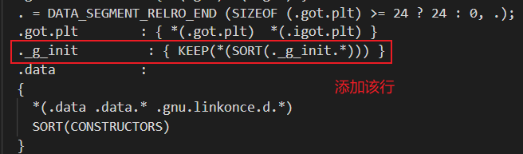
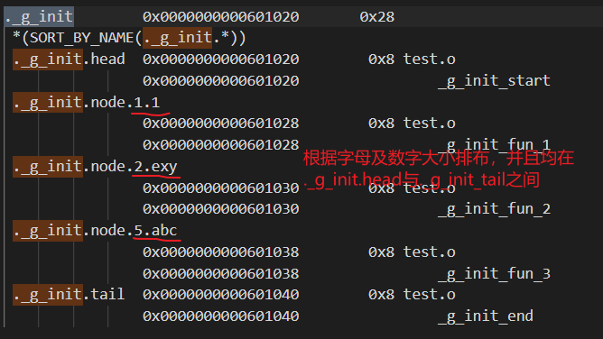
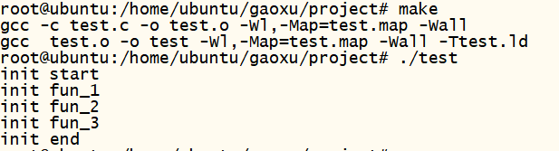

使用 \_\_attribute__((section(x))) 指定变量所放置的段中的，用处是方便实现优雅的初始化函数调用。在 RT-Thread 和 Linux 中就有使用该特性用来实现函数的初始化调用。下面以一个例子来展示如何使用 section 关键字来实现函数的初始化。

# 1. 示例分析
主函数很简单，仅调用一个函数，如下：

```c
int main(int argc, const char *argv[])
{
    _g_init_func();
    return 0;
}
```

`_g_init_func()` 函数会初始化所有需要初始化的函数，其实现如下：

```c
void _g_init_func(void) 
{
    const init_fn_t *fun_ptr;

    for (fun_ptr = &_g_init_start; fun_ptr <= &_g_init_end; ++fun_ptr) {
        (*fun_ptr)();
    }
}
```

`_g_init_func()` 函数的作用就是把 &_g_init_start, &_g_init_end 这两个内存地址之间的所有函数全部初始化一遍。`_g_init_func()` 函数中的 init_fn_t 是一个函数指针，用于指向各个需要初始化的函数，定义如下：

```c
typedef int (*init_fn_t)(void);
```

&_g_init_start, &_g_init_end 这两个是需要初始化函数的起始和结束地址，实现方式如下：

```c
#define USED                    __attribute__((used))
#define SECTION(x)              __attribute__((section(x)))
#define INIT_EXPORT_HEAD(fn)  const init_fn_t _g_init_##fn SECTION("._g_init.head") USED = fn
#define INIT_EXPORT_TAIL(fn)  const init_fn_t _g_init_##fn SECTION("._g_init.tail") USED = fn
#define DECLARE_INIT(fn, level)  const init_fn_t _g_init_##fn SECTION("._g_init.node."#level) USED = fn

static int start(void)
{
    printf("init %s\r\n", __func__);
    return 0;
}
INIT_EXPORT_HEAD(start);

static int end(void)
{
    printf("init %s\r\n", __func__);
    return 0;
}
INIT_EXPORT_TAIL(end);
```

可以看到，`INIT_EXPORT_HEAD(start)` 宏可以将 _g_init_start 这个 init_fn_t 类型的函数指针存放到 .g_init.head 段中；同理，`INIT_EXPORT_TAIL(end)` 宏就是将 _g_init_end 这个 init_fn_t 类型的函数指针存放到 .g_init.tail 段中。所以 _g_init_start 与 _g_init_end 的地址就是段 .g_init.head 和段 .g_init.tail 的地址。


接下来就是实现自己的初始化函数，然后调用 `DECLARE_INIT(fn, level)` 宏，其 fn 是函数名，level 的作用是控制我们自己实现的函数的初始化顺序的。

- 注，这里需要说明一下，gcc 编译器默认是按照使用顺序链接全局变量的(链接顺序又决定了地址排布)，如果想让 gcc 编译器按照字母及数字大小来链接全局变量的话就需要修改一下 ld 脚本。

我们要实现函数自动初始化，就需要保证我们自己实现的初始化函数的地址在链接后排布在 .g_init.head 与 .g_init.tail 之间，这样初始化时才能找到我们自己实现的函数。

如下实现的初始化函数：

```c
static int fun_1(void)
{
    printf("init %s\r\n", __func__);
    return 0;
}
DECLARE_INIT(fun_1, 1.1);

static int fun_3(void)
{
    printf("init %s\r\n", __func__);
    return 0;
}
DECLARE_INIT(fun_3, 5.abc);

static int fun_2(void)
{
    printf("init %s\r\n", __func__);
    return 0;
}
DECLARE_INIT(fun_2, 2.exy);
```

# 2. 查找 gcc 默认使用的 ld 脚本
上面提到过，如果使用 gcc 默认的 ld 脚本的话，那不能保证 fun_1, fun_2, fun_3 的内存地址是按字母及数字大小排布的，所以需要我们手动修改一下 gcc 的 ld 脚本。

虽然 gcc 默认使用的 ld 脚本已经被编译到 ld 链接器了，但可以使用如下命令查看到 ld 脚本：

```bash
ld -verbose
```

其输出结果如下：

```
GNU ld (GNU Binutils for Ubuntu) 2.30
  Supported emulations:
   elf_x86_64
   elf32_x86_64
   elf_i386
   elf_iamcu
   i386linux
   elf_l1om
   elf_k1om
   i386pep
   i386pe
using internal linker script:
==================================================
/* Script for -z combreloc: combine and sort reloc sections */
/* Copyright (C) 2014-2018 Free Software Foundation, Inc.
   Copying and distribution of this script, with or without modification,
   are permitted in any medium without royalty provided the copyright
   notice and this notice are preserved.  */
OUTPUT_FORMAT("elf64-x86-64", "elf64-x86-64",
              "elf64-x86-64")
OUTPUT_ARCH(i386:x86-64)
ENTRY(_start)
SEARCH_DIR("=/usr/local/lib/x86_64-linux-gnu"); SEARCH_DIR("=/lib/x86_64-linux-gnu"); SEARCH_DIR("=/usr/lib/x86_64-linux-gnu"); SEARCH_DIR("=/usr/lib/x86_64-linux-gnu64"); SEARCH_DIR("=/usr/local/lib64"); SEARCH_DIR("=/lib64"); SEARCH_DIR("=/usr/lib64"); SEARCH_DIR("=/usr/local/lib"); SEARCH_DIR("=/lib"); SEARCH_DIR("=/usr/lib"); SEARCH_DIR("=/usr/x86_64-linux-gnu/lib64"); SEARCH_DIR("=/usr/x86_64-linux-gnu/lib");
SECTIONS
{
  /* Read-only sections, merged into text segment: */
  PROVIDE (__executable_start = SEGMENT_START("text-segment", 0x400000)); . = SEGMENT_START("text-segment", 0x400000) + SIZEOF_HEADERS;
  .interp         : { *(.interp) }
  .note.gnu.build-id : { *(.note.gnu.build-id) }
  .hash           : { *(.hash) }
  .gnu.hash       : { *(.gnu.hash) }
  .dynsym         : { *(.dynsym) }
  .dynstr         : { *(.dynstr) }
  .gnu.version    : { *(.gnu.version) }
  .gnu.version_d  : { *(.gnu.version_d) }
  .gnu.version_r  : { *(.gnu.version_r) }
  .rela.dyn       :
    {
      *(.rela.init)
      *(.rela.text .rela.text.* .rela.gnu.linkonce.t.*)
      *(.rela.fini)
      *(.rela.rodata .rela.rodata.* .rela.gnu.linkonce.r.*)
      *(.rela.data .rela.data.* .rela.gnu.linkonce.d.*)
      *(.rela.tdata .rela.tdata.* .rela.gnu.linkonce.td.*)
      *(.rela.tbss .rela.tbss.* .rela.gnu.linkonce.tb.*)
      *(.rela.ctors)
      *(.rela.dtors)
      *(.rela.got)
      *(.rela.bss .rela.bss.* .rela.gnu.linkonce.b.*)
      *(.rela.ldata .rela.ldata.* .rela.gnu.linkonce.l.*)
      *(.rela.lbss .rela.lbss.* .rela.gnu.linkonce.lb.*)
      *(.rela.lrodata .rela.lrodata.* .rela.gnu.linkonce.lr.*)
      *(.rela.ifunc)
    }
  .rela.plt       :
    {
      *(.rela.plt)
      PROVIDE_HIDDEN (__rela_iplt_start = .);
      *(.rela.iplt)
      PROVIDE_HIDDEN (__rela_iplt_end = .);
    }
  .init           :
  {
    KEEP (*(SORT_NONE(.init)))
  }
  .plt            : { *(.plt) *(.iplt) }
.plt.got        : { *(.plt.got) }
.plt.sec        : { *(.plt.sec) }
  .text           :
  {
    *(.text.unlikely .text.*_unlikely .text.unlikely.*)
    *(.text.exit .text.exit.*)
    *(.text.startup .text.startup.*)
    *(.text.hot .text.hot.*)
    *(.text .stub .text.* .gnu.linkonce.t.*)
    /* .gnu.warning sections are handled specially by elf32.em.  */
    *(.gnu.warning)
  }
  .fini           :
  {
    KEEP (*(SORT_NONE(.fini)))
  }
  PROVIDE (__etext = .);
  PROVIDE (_etext = .);
  PROVIDE (etext = .);
  .rodata         : { *(.rodata .rodata.* .gnu.linkonce.r.*) }
  .rodata1        : { *(.rodata1) }
  .eh_frame_hdr : { *(.eh_frame_hdr) *(.eh_frame_entry .eh_frame_entry.*) }
  .eh_frame       : ONLY_IF_RO { KEEP (*(.eh_frame)) *(.eh_frame.*) }
  .gcc_except_table   : ONLY_IF_RO { *(.gcc_except_table
  .gcc_except_table.*) }
  .gnu_extab   : ONLY_IF_RO { *(.gnu_extab*) }
  /* These sections are generated by the Sun/Oracle C++ compiler.  */
  .exception_ranges   : ONLY_IF_RO { *(.exception_ranges
  .exception_ranges*) }
  /* Adjust the address for the data segment.  We want to adjust up to
     the same address within the page on the next page up.  */
  . = DATA_SEGMENT_ALIGN (CONSTANT (MAXPAGESIZE), CONSTANT (COMMONPAGESIZE));
  /* Exception handling  */
  .eh_frame       : ONLY_IF_RW { KEEP (*(.eh_frame)) *(.eh_frame.*) }
  .gnu_extab      : ONLY_IF_RW { *(.gnu_extab) }
  .gcc_except_table   : ONLY_IF_RW { *(.gcc_except_table .gcc_except_table.*) }
  .exception_ranges   : ONLY_IF_RW { *(.exception_ranges .exception_ranges*) }
  /* Thread Local Storage sections  */
  .tdata          : { *(.tdata .tdata.* .gnu.linkonce.td.*) }
  .tbss           : { *(.tbss .tbss.* .gnu.linkonce.tb.*) *(.tcommon) }
  .preinit_array     :
  {
    PROVIDE_HIDDEN (__preinit_array_start = .);
    KEEP (*(.preinit_array))
    PROVIDE_HIDDEN (__preinit_array_end = .);
  }
  .init_array     :
  {
    PROVIDE_HIDDEN (__init_array_start = .);
    KEEP (*(SORT_BY_INIT_PRIORITY(.init_array.*) SORT_BY_INIT_PRIORITY(.ctors.*)))
    KEEP (*(.init_array EXCLUDE_FILE (*crtbegin.o *crtbegin?.o *crtend.o *crtend?.o ) .ctors))
    PROVIDE_HIDDEN (__init_array_end = .);
  }
  .fini_array     :
  {
    PROVIDE_HIDDEN (__fini_array_start = .);
    KEEP (*(SORT_BY_INIT_PRIORITY(.fini_array.*) SORT_BY_INIT_PRIORITY(.dtors.*)))
    KEEP (*(.fini_array EXCLUDE_FILE (*crtbegin.o *crtbegin?.o *crtend.o *crtend?.o ) .dtors))
    PROVIDE_HIDDEN (__fini_array_end = .);
  }
  .ctors          :
  {
    /* gcc uses crtbegin.o to find the start of
       the constructors, so we make sure it is
       first.  Because this is a wildcard, it
       doesn't matter if the user does not
       actually link against crtbegin.o; the
       linker won't look for a file to match a
       wildcard.  The wildcard also means that it
       doesn't matter which directory crtbegin.o
       is in.  */
    KEEP (*crtbegin.o(.ctors))
    KEEP (*crtbegin?.o(.ctors))
    /* We don't want to include the .ctor section from
       the crtend.o file until after the sorted ctors.
       The .ctor section from the crtend file contains the
       end of ctors marker and it must be last */
    KEEP (*(EXCLUDE_FILE (*crtend.o *crtend?.o ) .ctors))
    KEEP (*(SORT(.ctors.*)))
    KEEP (*(.ctors))
  }
  .dtors          :
  {
    KEEP (*crtbegin.o(.dtors))
    KEEP (*crtbegin?.o(.dtors))
    KEEP (*(EXCLUDE_FILE (*crtend.o *crtend?.o ) .dtors))
    KEEP (*(SORT(.dtors.*)))
    KEEP (*(.dtors))
  }
  .jcr            : { KEEP (*(.jcr)) }
  .data.rel.ro : { *(.data.rel.ro.local* .gnu.linkonce.d.rel.ro.local.*) *(.data.rel.ro .data.rel.ro.* .gnu.linkonce.d.rel.ro.*) }
  .dynamic        : { *(.dynamic) }
  .got            : { *(.got) *(.igot) }
  . = DATA_SEGMENT_RELRO_END (SIZEOF (.got.plt) >= 24 ? 24 : 0, .);
  .got.plt        : { *(.got.plt)  *(.igot.plt) }
  .data           :
  {
    *(.data .data.* .gnu.linkonce.d.*)
    SORT(CONSTRUCTORS)
  }
  .data1          : { *(.data1) }
  _edata = .; PROVIDE (edata = .);
  . = .;
  __bss_start = .;
  .bss            :
  {
   *(.dynbss)
   *(.bss .bss.* .gnu.linkonce.b.*)
   *(COMMON)
   /* Align here to ensure that the .bss section occupies space up to
      _end.  Align after .bss to ensure correct alignment even if the
      .bss section disappears because there are no input sections.
      FIXME: Why do we need it? When there is no .bss section, we don't
      pad the .data section.  */
   . = ALIGN(. != 0 ? 64 / 8 : 1);
  }
  .lbss   :
  {
    *(.dynlbss)
    *(.lbss .lbss.* .gnu.linkonce.lb.*)
    *(LARGE_COMMON)
  }
  . = ALIGN(64 / 8);
  . = SEGMENT_START("ldata-segment", .);
  .lrodata   ALIGN(CONSTANT (MAXPAGESIZE)) + (. & (CONSTANT (MAXPAGESIZE) - 1)) :
  {
    *(.lrodata .lrodata.* .gnu.linkonce.lr.*)
  }
  .ldata   ALIGN(CONSTANT (MAXPAGESIZE)) + (. & (CONSTANT (MAXPAGESIZE) - 1)) :
  {
    *(.ldata .ldata.* .gnu.linkonce.l.*)
    . = ALIGN(. != 0 ? 64 / 8 : 1);
  }
  . = ALIGN(64 / 8);
  _end = .; PROVIDE (end = .);
  . = DATA_SEGMENT_END (.);
  /* Stabs debugging sections.  */
  .stab          0 : { *(.stab) }
  .stabstr       0 : { *(.stabstr) }
  .stab.excl     0 : { *(.stab.excl) }
  .stab.exclstr  0 : { *(.stab.exclstr) }
  .stab.index    0 : { *(.stab.index) }
  .stab.indexstr 0 : { *(.stab.indexstr) }
  .comment       0 : { *(.comment) }
  /* DWARF debug sections.
     Symbols in the DWARF debugging sections are relative to the beginning
     of the section so we begin them at 0.  */
  /* DWARF 1 */
  .debug          0 : { *(.debug) }
  .line           0 : { *(.line) }
  /* GNU DWARF 1 extensions */
  .debug_srcinfo  0 : { *(.debug_srcinfo) }
  .debug_sfnames  0 : { *(.debug_sfnames) }
  /* DWARF 1.1 and DWARF 2 */
  .debug_aranges  0 : { *(.debug_aranges) }
  .debug_pubnames 0 : { *(.debug_pubnames) }
  /* DWARF 2 */
  .debug_info     0 : { *(.debug_info .gnu.linkonce.wi.*) }
  .debug_abbrev   0 : { *(.debug_abbrev) }
  .debug_line     0 : { *(.debug_line .debug_line.* .debug_line_end ) }
  .debug_frame    0 : { *(.debug_frame) }
  .debug_str      0 : { *(.debug_str) }
  .debug_loc      0 : { *(.debug_loc) }
  .debug_macinfo  0 : { *(.debug_macinfo) }
  /* SGI/MIPS DWARF 2 extensions */
  .debug_weaknames 0 : { *(.debug_weaknames) }
  .debug_funcnames 0 : { *(.debug_funcnames) }
  .debug_typenames 0 : { *(.debug_typenames) }
  .debug_varnames  0 : { *(.debug_varnames) }
  /* DWARF 3 */
  .debug_pubtypes 0 : { *(.debug_pubtypes) }
  .debug_ranges   0 : { *(.debug_ranges) }
  /* DWARF Extension.  */
  .debug_macro    0 : { *(.debug_macro) }
  .debug_addr     0 : { *(.debug_addr) }
  .gnu.attributes 0 : { KEEP (*(.gnu.attributes)) }
  /DISCARD/ : { *(.note.GNU-stack) *(.gnu_debuglink) *(.gnu.lto_*) }
}


==================================================
```

我们在自己的工程中新建一个 test.ld 文件，然后把上面输出的结果拷贝到 test.ld 中制作成我们自己的 ld 脚本。

# 3. 修改 ld 脚本
在 test.ld 中添加如下代码：



上图该行的作用就是让 ._g_init 段的内存布局是按照字母及数字大小顺序排列。

# 4. 编译及运行
编译需要注意两点，1.生成 map 文件；2. 指定 ld 脚本。如下：

```
gcc test.c -o test -Wl,-Map=test.map -Ttest.ld
```

查看 map 文件，其 ._g_init 的内存布局如下：



运行结果如下：



由上图可以看到，初始化的顺序是我们所期望的。

程序源码见当前目录的 ./project 文件夹， 执行 make 即可编译。

# 5. 外话
为什么说 gcc 的 ld 脚本已被编译进了 ld 链接器了勒，我们可以执行如下命令：

```bash
find /usr/* | xargs grep "Script for -z combreloc: combine and sort reloc sections"
```

然后输出结果有：

```
Binary file /usr/bin/ld matches
```

由此可知，ld 脚本已被编译进了 ld 链接器了。

