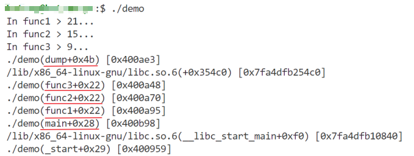
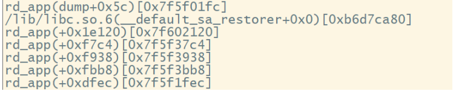
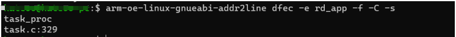

# 函数
## 头文件

```c
#include <execinfo.h>  
```

## backtrace()
函数原型：

`int backtrace(void **buffer, int size);`

含义：该函数获取当前线程的调用堆栈，获取的信息将会被存放在buffer中，它是一个指针数组，参数size用来指定buffer中可以保存多少个void\*元素。函数的返回值是实际返回的void\*元素个数。buffer中的void*元素实际是从堆栈中获取的返回地址。

## backtrace_symbols()
函数原型：

`char **backtrace_symbols(void *const *buffer, int size)`

含义：该函数将backtrace函数获取的信息转化为一个字符串数组，参数buffer是backtrace获取的堆栈指针，size是backtrace返回值。函数返回值是一个指向字符串数组的指针，它包含char\*元素个数为size。每个字符串包含了一个相对于buffer中对应元素的可打印信息，包括函数名、函数偏移地址和实际返回地址。

backtrace_symbols生成的字符串占用的内存是malloc出来的，但是是一次性malloc出来的，释放是只需要一次性释放返回的二级指针即可。

## backtrace_symbols_fd()
函数原型：

`void backtrace_symbols_fd(void *const *buffer, int size, int fd);`

含义：该函数与backtrace_symbols函数功能相同，只是它不会malloc内存，而是将结果写入文件描述符为fd的文件中，每个函数对应一行。该函数可重入。

## 注意
- backtrace的实现依赖于栈指针（fp寄存器），在gcc编译过程中任何非零的优化等级（-On参数）或加入了栈指针优化参数-fomit-frame-pointer后多将不能正确得到程序栈信息；
- backtrace_symbols的实现需要符号名称的支持，在gcc编译过程中需要加入-rdynamic参数；
- 内联函数没有栈帧，它在编译过程中被展开在调用的位置；
- 尾调用优化（Tail-call Optimization）将复用当前函数栈，而不再生成新的函数栈，这将导致栈信息不能正确被获取。

# 测试demo
用于示范程序在访问非法地址导致异常退出：

```c
#include <stdio.h>
#include <unistd.h>
#include <stdlib.h>
#include <execinfo.h>
#include <signal.h>
void func3(void)
{
    printf("In %s > %d...\n", __func__, __LINE__);
    *((volatile char *)0x0) = 0x9999; //模拟访问非法地址
}

void func2(void)
{
    printf("In %s > %d...\n", __func__, __LINE__);
    func3();
}

void func1(void)
{
    printf("In %s > %d...\n", __func__, __LINE__);
    func2();
}

void dump(int signo)
{
    #define MAX_DEPTH (20)
    void *info[MAX_DEPTH] = {0};
    int depth = backtrace(info, MAX_DEPTH);
    char **strings = backtrace_symbols(info, depth);

    for (int i = 0; i < depth; i++)
    {
        printf("%s\n", strings[i]);
    }
    if (strings)
        free(strings);
    exit(0);
}

int main(void)
{
    if (signal(SIGSEGV, dump) == SIG_ERR)
    perror("can't catch SIGSEGV");
    func1();
    return 0;
}
```

在linux下编译：`gcc -rdynamic demo.c -o demo`

运行结果如下：


# 嵌入式demo
主要包含以下步骤：

```
- 复制获取处理栈信息的 dump 函数
- 在main函数中增加Linux信号回调
- 增加编译参数 -rdynamic -funwind-tables -ffunction-sections ，同时需要注意，
如果编译代码开启了编译优化，需要关闭掉，设置 -O0 的等级优化，否则可能无法正确打印函数信息
```

代码如下：

```c
void dump(int signo)
{
    #define MAX_DEPTH (20)
    void *info[MAX_DEPTH] = {0};
    int depth = backtrace(info, MAX_DEPTH);
    char **strings = backtrace_symbols(info, depth);

    for (int i = 0; i < depth; i++)
    {
        printf("%s\n", strings[i]);
    }
    if (strings)
        free(strings);
    exit(0);
}

int main(void)
{
    ...
    if (signal(SIGSEGV, dump) == SIG_ERR)
    perror("can't catch SIGSEGV");
    ...
}
```

注意，终端中运行可能出现如下情况：


没有函数名，只有函数地址，此时可以在编译环境中，使用以下以下命令查询函数位置：（注意不同模组，编译链可能有区别）

`arm-oe-linux-gnueabi-addr2line <地址> -e <app文件名> -f -C -s` 

在本次测试中如上图，最后一个地址为0xdfec， 我的程序文件名为:rd_app,获取结果如下：




另外，可以将栈信息输出到log文件中，便于后续分析，可以使用以下dump函数，具体其他需求，可自行调整。代码见 trace_sample.c 文件。
